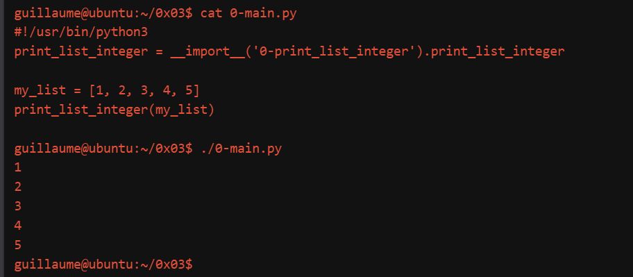
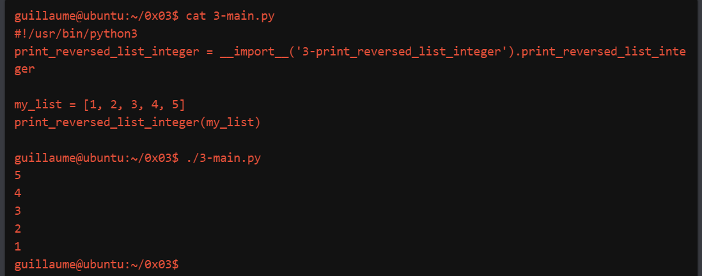

Python - Data Structures: Lists, Tuples - TASK QUESTIONS
=====================================================================
# 0. Print a list of integers
**Mandatory**

Write a function that prints all integers of a list.

## Prototype: def print_list_integer(my_list=[]):
_Format: one integer per line. See example_
- You are not allowed to import any module
- You can assume that the list only contains integers
- You are not allowed to cast integers into strings
- You have to use str.format() to print integers

=====================================================================
# 1. Secure access to an element in a list
**Mandatory**

Write a function that retrieves an element from a list like in C.

## Prototype: def element_at(my_list, idx):
- If idx is negative, the function should return None
- If idx is out of range (> of number of element in my_list), the function should return None
- You are not allowed to import any module
- You are not allowed to use try/except
======================================================================
# 2. Replace element
**Mandatory**

Write a function that replaces an element of a list at a specific position (like in C).

## Prototype: def replace_in_list(my_list, idx, element):
- If idx is negative, the function should not modify anything, and returns the original list
- If idx is out of range (> of number of element in my_list), the function should not modify anything, and returns the original list
- You are not allowed to import any module
- You are not allowed to use try/except
======================================================================
# 3. Print a list of integers... in reverse!
**Mandatory**

Write a function that prints all integers of a list, in reverse order.

## Prototype: def print_reversed_list_integer(my_list=[]):
_Format: one integer per line. See example_
- You are not allowed to import any module
- You can assume that the list only contains integers
- You are not allowed to cast integers into strings
- You have to use str.format() to print integers

======================================================================
# 4. Replace in a copy
**Mandatory**

Write a function that replaces an element in a list at a specific position without modifying the original list (like in C).

## Prototype: def new_in_list(my_list, idx, element):
- If idx is negative, the function should return a copy of the original list
- If idx is out of range (> of number of element in my_list), the function should return a copy of the original list
- You are not allowed to import any module
- You are not allowed to use try/except
=======================================================================
# 5. Can you C me now?
**Mandatory**

Write a function that removes all characters c and C from a string.

## Prototype: def no_c(my_string):
- The function should return the new string
- You are not allowed to import any module
- You are not allowed to use str.replace()
=======================================================================
# 6. Lists of lists = Matrix
**Mandatory**

Write a function that prints a matrix of integers.

## Prototype: def print_matrix_integer(matrix=[[]]):
_Format: see example_
- You are not allowed to import any module
- You can assume that the list only contains integers
- You are not allowed to cast integers into strings
- You have to use str.format() to print integers

=======================================================================
# 7. Tuples addition
**Mandatory**

Write a function that adds 2 tuples.

## Prototype: def add_tuple(tuple_a=(), tuple_b=()):
- Returns a tuple with 2 integers:
- The first element should be the addition of the first element of each argument
- The second element should be the addition of the second element of each argument
- You are not allowed to import any module
- You can assume that the two tuples will only contain integers
- If a tuple is smaller than 2, use the value 0 for each missing integer
- If a tuple is bigger than 2, use only the first 2 integers
=======================================================================
# 8. More returns!
**Mandatory**

Write a function that returns a tuple with the length of a string and its first character.

## Prototype: def multiple_returns(sentence):
- If the sentence is empty, the first character should be equal to None
- You are not allowed to import any module.
=======================================================================
# 9. Find the max
**Mandatory**

Write a function that finds the biggest integer of a list.

## Prototype: def max_integer(my_list=[]):
- If the list is empty, return None
- You can assume that the list only contains integers
- You are not allowed to import any module
- You are not allowed to use the builtin max()
========================================================================
# 10. Only by 2
**Mandatory**

Write a function that finds all multiples of 2 in a list.

## Prototype: def divisible_by_2(my_list=[]):
- Return a new list with True or False, depending on whether the integer at the same position in the original list is a multiple of 2
- The new list should have the same size as the original list
- You are not allowed to import any module.
========================================================================
# 11. Delete at
**Mandatory**

Write a functio**n that deletes the item at a specific position in a list.

## Prototype: def delete_at(my_list=[], idx=0):
- If idx is negative or out of range, nothing change (returns the same list)
- You are not allowed to use pop()
- You are not allowed to import any module
=========================================================================
# 12. Switch
**Mandatory**

_Complete the source code in order to switch value of a and b_

- You can find the source code [here](https://github.com/alx-tools/0x03.py/blob/master/12-switch_py)
- Your code should be inserted where the comment is (line 4)
- Your program should be exactly 5 lines long
=========================================================================
# 13. Linked list palindrome
**Mandatory**

## Technical interview preparation:

- You are not allowed to google anything
- Whiteboard first
### Write a function in C that checks if a singly linked list is a palindrome.

_Prototype:_ _int is_palindrome(listint_t **head);_
- Return: 0 if it is not a palindrome, 1 if it is a palindrome
- An empty list is considered a palindrome
==========================================================================
# 14. CPython #0: Python lists
**Advanced**

- CPython is the reference implementation of the Python programming language. Written in C, CPython is the default and most widely used implementation of the language.
- Since we now know a bit of C, we can look at what is happening under the hood of Python. Let’s have fun with Python and C, and let’s look at what makes Python so easy to use.

All your files will be interpreted/compiled on Ubuntu 14.04 LTE

_Create a C function that prints some basic info about Python lists._

_Prototype: void print_python_list_info(PyObject *p);_
_ Format: see example
_Python version: 3.4_
 Your shared library will be compiled with this command line: gcc -Wall -Werror -Wextra -pedantic -std=c99 -shared -Wl,-soname,PyList -o libPyList.so -fPIC -I/usr/include/python3.4 100-print_python_list_info.c
- OS: Ubuntu 14.04 LTS
## Start by reading:
- listobject.h
- object.h
Common Object Structures
List Objects

